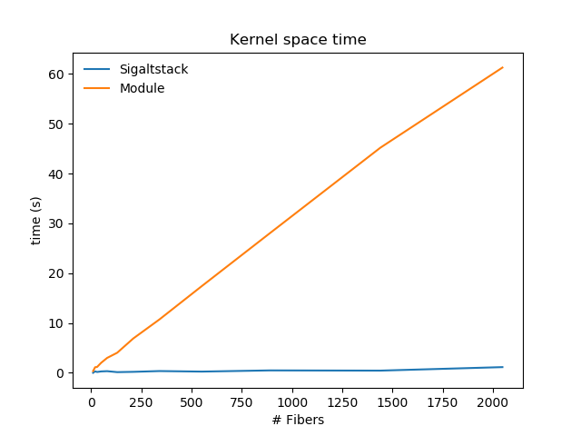

---
author:
- 'Beatrice Bevilacqua, Anxhelo Xhebraj'
date: September 2018
title: Loadable Kernel Module based Fibers
---

-   [Introduction](#introduction)
-   [Interface](#interface)
-   [Module](#module)
    -   [Fiber creation](#fiber-creation)
    -   [Fiber switching](#fiber-switching)
    -   [Fiber Local Storage](#fiber-local-storage)
-   [`procfs` extension](#procfs-extension)
-   [Performance](#performance)
-   [Conclusions](#conclusions)

{width="100%"}

Introduction
------------

Coroutines are a programming paradigm that offers time-sharing
non-preemptive multitasking which can be used to implement many patterns
such as the Actor model, State machines and Communicating Sequential
Processes. This concept has influenced many programming languages such
as Go and Clojure especially for handling asynchronous I/O operations.

In this document we present a Loadable Kernel Module (LKM)
implementation taking as reference the Fibers implementation offered by
Windows NT and ReactOS. While user space implementations are generally
preferred for their low over-head and easier debugging, a kernel space
implementation permits to understand more deeply how kernel subsystems
work.

The project is composed of two main parts:

-   a LKM that implements the facilities to perform the yielding of a
    fiber and managing their context with an additional component that
    extends `procfs` to provide information about fibers under
    `/proc/<tgid>`

-   a user space library to invoke the previously mentioned facilities

The code has been tested from kernel 4.16 up [^1].

Interface
---------

The entry points to kernel space code are exported by the library which
performs `ioctl()` calls to a special
*[miscdevice](https://www.linuxjournal.com/article/2920)* registered by
the module at load time. Differently from "typical" character devices,
miscdevices are more suited for implementing just an entry point to
kernel facilities than reserving a full range of minor numbers
representing actual devices.

**`module/fibers.c`**

```C {.lineAnchors .numberLines .C caption="module/fibers.c" startFrom="10"}
static struct file_operations fibers_fops = {
	.owner = THIS_MODULE,
	.open = device_open,
	.release = device_release,
	.unlocked_ioctl = device_ioctl
};

static struct miscdevice fibers_dev = {
	.minor = MISC_DYNAMIC_MINOR,
	.name = DEVICE_NAME,
	.fops = &fibers_fops,
	.mode = S_IALLUGO
};
```

```C {.lineAnchors .numberLines .C caption="module/fibers.c" startFrom="39"}
int init_module(void)
{
	// Device registration for userspace-driver communication
	int minor = misc_register(&fibers_dev);
	if (minor < 0) {
		alert("Failed to register /dev/%s\n", DEVICE_NAME);
		return minor;
	}

	initialize_proc();

	return SUCCESS;
}
```

After the load of the module a new file called `fibers` is exposed in
`/dev` and the `.fibers` folder appears under `/proc`. The file
operations implemented for such device are `open`, `release` and `ioctl`
which are called upon the respective system calls invokations on the
file through the functions offered by the library.

**`lib/fibers.c`**

```C {.lineAnchors .numberLines .C caption="lib/fibers.c" startFrom="4"}
static int __fibers_file = -1;

static void __attribute__ ((constructor)) __file_opener();
```

```C {.lineAnchors .numberLines .C caption="lib/fibers.c" startFrom="20"}
static void __fork_handler()
{
	int err = close(__fibers_file);
	__fibers_file = open("/dev/" DEVICE_NAME, 0);
	if (__fibers_file < 0) {
		log_fatal("Fiber file is not open, exiting...");
	}
}

static void __file_opener()
{
	__fibers_file = open("/dev/" DEVICE_NAME, 0);
	if (__fibers_file < 0) {
		log_fatal("Fiber file is not open, exiting...");
	}
	int err = pthread_atfork(NULL, NULL, __fork_handler);
	if (err) {
		log_fatal("Couldn't register atfork handler");
	}
}
```

The library provided defines a constructor function which opens the file
thus instantiating one *file descriptor*[^2] designated to communicate
with the module. Since a file descriptor represents a pool of fibers all
the threads belonging to the process are allowed to interact and execute
fibers of such process. Moreover, the code can easily be extended to
support multiple opens of the `fibers` file to create separate pools of
fibers and thus implement different scheduling strategies such as
assigning different pools to different threads.

In order to avoid unintended sharing of fibers pool from parent process
to child after a `fork()` caused by file descriptor inheritance, an
*atfork* function is registered to be run on the child after a fork,
which closes the parent descriptor and reopens the file.

Finally, in the library there are respectively implemented, based on
`ioctl` calls on the `__fibers_file` file descriptor, the functions to
convert a thread to fiber, create a new fiber, yielding from a fiber to
another one and allocate and manage fixed size memory (Fiber Local
Storage).

**`include/lib/fibers.h`**

```C {.lineAnchors .numberLines .C caption="include/lib/fibers.h" startFrom="15"}
void *to_fiber(void);
void *create_fiber(size_t stack_size, void (*entry_point) (void *),
		   void *param);
void switch_fiber(void *fid);
long fls_alloc(void);
bool fls_free(long index);
void fls_set(long index, long long value);
long long fls_get(long index);
```

All these functions prepare data structures to be passed to their
relative kernel space implementations and invoke the following wrapper
of the `ioctl` system call. The code saves the callee-save register in
case of switching from one fiber to another since they are not saved by
the Linux system call dispatcher. This is needed in order to correctly
save and restore the execution context of a fiber otherwise it would not
be possible to obtain the state of such registers when the system call
is performed in kernel space.

**`lib/fibers.c`**

```C {.lineAnchors .numberLines .C caption="lib/fibers.c" startFrom="55"}
long fib_ioctl(unsigned int fd, unsigned int cmd, unsigned long arg)
{
	long res = 0;
	if (cmd == IOCTL_SWITCH_FIB) {
		asm volatile ("push %%rbx \n\t"
			      "push %%rbp \n\t"
			      "push %%r12 \n\t"
			      "push %%r13 \n\t"
			      "push %%r14 \n\t"
			      "push %%r15 \n\t"
			      "syscall \n\t"
			      "pop %%r15 \n\t"
			      "pop %%r14 \n\t"
			      "pop %%r13 \n\t"
			      "pop %%r12 \n\t"
			      "pop %%rbp \n\t" "pop %%rbx \n\t":"=a" (res)
			      :"0"(SYS_ioctl), "D"(fd), "S"(cmd), "d"(arg):
			      "memory");
	} else {
		asm volatile ("syscall \n\t":"=a" (res)
			      :"0"(SYS_ioctl), "D"(fd), "S"(cmd), "d"(arg):
			      "memory");

	}

	return res;
}
```

Module
------

**`include/module/common.h`**

```C {.lineAnchors .numberLines .C caption="include/module/common.h" startFrom="34"}
struct fibers_data {
	struct idr fibers_pool;
	struct proc_dir_entry *base;
	unsigned long fls[MAX_FLS];
	unsigned long bitmap[FLS_BSIZE];
};
```

When the constructor defined by the library is executed, the `open` file
operation is performed which initializes a `struct fibers_data` that
keeps the per process information such as:

-   `fibers_pool`: an
    *[idr](https://www.kernel.org/doc/html/v4.17/core-api/idr.html)*
    data structure that maintains the fibers of the process. Internally
    it uses a [radix tree](https://lwn.net/Articles/175432/), making
    efficient the assignment of an id to fibers and later retrieving
    them by the same id

-   `base`: the directory entry associated to `/proc/.fibers/<tgid>`, a
    directory keeping one file for each fiber created by the process. As
    explained [later](#procfs-extension) a symlink (`fibers`) to such
    directory is added under `/proc/<tgid>`

-   `fls`: an array keeping the allocation units provided to the fibers

-   `bitmap`: bitmap to manage the allocation and deallocation of the
    aforementioned units

The struct is then stored in the `private_data` field of the file
descriptor which is a free field that can be used by device drivers for
such purposes to later retrieve it on `ioctl`.

These data structures are finally freed on the `release` operation of
the file which is called when the `struct file` associated to the file
is going to be freed by the kernel, i.e. on close of the file or
exit/fault of the process.

The fibers' pool maintains structures of the following type.

**`include/module/common.h`**

```C {.lineAnchors .numberLines .C caption="include/module/common.h" startFrom="20"}
struct fiber_struct {
	unsigned long state;	// RUNNING-STOPPED
	unsigned long entry_point;
	pid_t pid;
	unsigned long activations;
	atomic64_t failed_activations;
	u64 laststart_utime;
	u64 laststart_stime;
	u64 utime;
	u64 stime;
	struct pt_regs exec_context;
	struct fpu fpuregs;
};
```

-   The `entry_point` is the address of the first instruction that a
    fiber will execute on first schedule

-   The `exec_context` and `fpuregs` fields are used to keep all the
    registers content to properly maintain the state of a fiber for
    context switching

-   The `state` field is used to avoid a fiber being run by two threads
    concurrently

-   The additional fields are used for statistics about the fibers which
    the user can retrieve from the file `/proc/<tgid>/fibers/<fiber_id>`

When the `ioctl` file operation is invoked, it calls the proper kernel
space function to handle the user space request.

### Fiber creation

A fiber data structure is created in case of a `create_fiber` or a
`to_fiber` call. The latter is only used to let the module acknowledge
that some thread can switch to other fibers and execution can resume at
such thread.

In brief the steps taken are:

-   Allocation of a `struct fiber_struct`, initialization of its fields
    and insertion in `fibers_pool` protected through
    *[rcu](https://lwn.net/Articles/262464/)*.

    In the case of `create_fiber` also the following actions are taken
    to set the right instruction pointer, stack pointer and parameter
    which are given by the userspace

    **`module/fibers_api.c`**

    ```C {.lineAnchors .numberLines .C caption="module/fibers_api.c" startFrom="49"}
    static inline void fiber_init_stopped(struct fiber_struct *f,
    				      struct create_data *data)
    {
    	f->state = FIB_STOPPED;
    	f->exec_context = *current_pt_regs();
    	f->exec_context.sp = (unsigned long)data->stack;
    	f->exec_context.ip = (unsigned long)data->entry_point;
    	f->exec_context.di = (unsigned long)data->param;
    	fiber_setup_stats(f, f->exec_context.ip);
    }
    ```

    The stack is allocated by the userspace library as follows

    **`lib/fibers.c`**

    ```C {.lineAnchors .numberLines .C caption="lib/fibers.c" startFrom="92"}
    void *create_fiber(size_t stack_size, void (*entry_point) (void *), void *param)
    {
    	void *stack = mmap(NULL, stack_size, PROT_WRITE | PROT_READ,
    			   MAP_PRIVATE | MAP_ANON, -1, 0);

    	if (stack == NULL) {
    		log_fatal("Couldn't allocate stack");
    	}

    	struct create_data data = {
    		// x86-64 System-V ABI requires stack to be aligned at 16 byte before
    		// issuing a `call` and compilers assume this when compiling the
    		// entry points of fibers. Therefore in order to emulate a call we
    		// need to remove 8 bytes as if there was the return address to the
    		// caller.
    		.stack = (void *)(((unsigned long)stack) + stack_size - 8),
    		.entry_point = entry_point,
    		.param = param
    	};
    ```

-   When adding the fiber in `fibers_pool` also a file under
    `/proc/.fibers/<tgid>` is created with name the id of the fiber. In
    the field `data` of `proc_dir_entry` corresponding to
    `/proc/.fibers/<tgid>/<fiber_id>` is stored a pointer to the
    associated `struct fiber_struct` to easily retrieve its statistics
    and then display them to the user.

-   Since it is needed to know which fiber is running on a given thread,
    at the bottom of the kernel stack, immediatly above the
    `struct thread_info`, is stored the pointer to the
    `struct fiber_struct`. .

    **`include/module/fibers_api.h`**

    ```C {.lineAnchors .numberLines .C caption="include/module/fibers_api.h" startFrom="22"}
    #define current_fiber (                                   \
                           *((struct fiber_struct **)         \
                           (((unsigned long)current->stack) + \
                           sizeof(struct thread_info)))       \
                          )
    ```

    The macro shown above acts as a per-thread kernel variable.
    Therefore `to_fiber` sets `current_fiber` as follows

    **`module/fibers_api.c:to_fiber`**

    ```C {.lineAnchors .numberLines .C caption="module/fibers_api.c" startFrom="114"}
    	// Save current running fiber at the bottom of the kernel stack
    	// of the thread it is running on
    	current_fiber = f;
    ```

### Fiber switching

**`module/fibers_api.c`**

```C {.lineAnchors .numberLines .C caption="module/fibers_api.c" startFrom="154"}
long switch_fiber(struct fibers_data *fibdata, fid_t fid)
{
	struct fiber_struct *next, *prev;
	bool old;
	struct pt_regs *regs;
	u64 utime, stime;
```

```C {.lineAnchors .numberLines .C caption="module/fibers_api.c" startFrom="177"}
	old = test_and_set_bit(0, &(next->state));
	if (unlikely(old == FIB_RUNNING)) {
		atomic64_inc(&next->failed_activations);
		return -1;
	}
```

```C {.lineAnchors .numberLines .C caption="module/fibers_api.c" startFrom="191"}
	regs = current_pt_regs();
	prev->exec_context = *regs;
	*regs = next->exec_context;

	fpu__save(&prev->fpuregs);

	preempt_disable();
	fpu__restore(&next->fpuregs);
	preempt_enable();

	test_and_clear_bit(0, &(prev->state));

	current_fiber = next;

	return 0;
}
```

First it is checked whether the fiber is already running through an
atomic test-and-set on the state of the fiber, in which case the switch
simply fails. The switch also fails in case the caller has not performed
`to_fiber` previously. This is ensured by checking whether
`current_fiber` is zero which is safe only if the kernel allocates a
zeroed stack to a thread and no stack overflow has happened.

Then the switch is performed by using the `struct pt_regs` found at the
top of the kernel stack which has been previously pushed by the Linux
system call dispatcher. By changing its fields and setting them to the
values of the fiber we want to switch to, when the dispatcher will
restore the userspace context, will let the execution proceed to the
just set context.

Finally the *fpu* registers are changed by using the functions provided
by the kernel, the previously running fiber is released and the
`current_fiber` is set properly.

### Fiber Local Storage

The allocator implemented for fibers is very simple. There is a fixed
number of entries kept in `fls` that can be allocated which are managed
by a bitmap keeping one bit for each entry telling whether it's free
(`0`) or occupied (`1`).

**`module/fibers_api.c`**

```C {.lineAnchors .numberLines .C caption="module/fibers_api.c" startFrom="208"}
long fls_alloc(struct fibers_data *fibdata)
{
	unsigned long idx;
	do {
		idx = find_first_zero_bit(fibdata->bitmap, MAX_FLS);
		if (idx == MAX_FLS) {
			return -1;
		}
	} while (test_and_set_bit(idx, fibdata->bitmap));
	return (long) idx;
}
```

```C {.lineAnchors .numberLines .C caption="module/fibers_api.c" startFrom="243"}
bool fls_free(struct fibers_data * fibdata, long idx)
{
	clear_bit(idx, fibdata->bitmap);
	return true;
}
```

`procfs` extension
------------------

As we have mentioned in the previous parts a `.fibers` directory is
created under `/proc` at module load and a directory for each thread
group id that opens the `/dev/fibers` file is created under
`/proc/.fibers`. In each directory is added one file for each fiber
instantiation of the group.

In order to make more *proc-oriented* such information a symbolic link
is added to `/proc/<tgid>` with name `fibers` pointing to the
corresponding `/proc/.fibers/<tgid>` directory.

Since the entries under `/proc/<tgid>` are [statically
defined](https://elixir.bootlin.com/linux/latest/source/fs/proc/base.c#L2902)
at compile time it's not possible to add such link through a module
except by hooking the functions that are called upon listing/moving a/to
a directory namely
[`proc_tgid_base_readdir`](https://elixir.bootlin.com/linux/latest/source/fs/proc/base.c#L2999),
[`proc_tgid_base_lookup`](https://elixir.bootlin.com/linux/latest/source/fs/proc/base.c#L3011)
respectively stored inside the `iter_shared` field of
[`proc_tgid_base_operations`](https://elixir.bootlin.com/linux/latest/source/fs/proc/base.c#L3005)
and `lookup` field of
[`proc_tgid_base_inode_operations`](https://elixir.bootlin.com/linux/latest/source/fs/proc/base.c#L3017).

**`module/proc.c`**

```C {.lineAnchors .numberLines .C caption="module/proc.c" startFrom="52"}
static const char *hooked_syms_names[] = {
	"proc_pid_link_inode_operations",
	"proc_fill_cache",
	"proc_pident_instantiate",
	"proc_tgid_base_operations",
	"proc_tgid_base_inode_operations"
};

static void *syms[HOOKED_SYMS_MAX];
```

```C {.lineAnchors .numberLines .C caption="module/proc.c" startFrom="185"}
void hook_symbols(void)
{
	int i = 0;

	for (i = 0; i < HOOKED_SYMS_MAX; i++) {
		syms[i] = (void *)kallsyms_lookup_name(hooked_syms_names[i]);
		if (!syms[i]) {
			warn("Failed retrieving symbol %s",
			     hooked_syms_names[i]);
		}
	}
```

```C {.lineAnchors .numberLines .C caption="module/proc.c" startFrom="207"}
	cr0 = read_cr0();
	unprotect_memory();
	orig_proc_tgid_base_readdir = proc_tgid_base_operations->iterate_shared;
	proc_tgid_base_operations->iterate_shared = wrap_proc_tgid_base_readdir;

	orig_proc_tgid_base_lookup = proc_tgid_base_inode_operations->lookup;
	proc_tgid_base_inode_operations->lookup = wrap_proc_tgid_base_lookup;
	protect_memory();
}
```

The hooked `readdir` first calls the original function to fill the
result with the correct directory entries and then similarly to the
original function instantiates a new directory entry of type link. In
order to do so, the first three symbols in `hooked_syms_names` and
additional re-definitions of not exported structs used and function
pointers types are needed.

Similar operations are taken for `lookup` but in this case the original
function is not invoked if the lookup is for the `fibers` directory.

Performance
-----------

](images/perf.svg){width="100%"}

The FlameGraph produced by `perf` shows that a good amount of time in
the simulation is spent inside the `fls_get` function. Note that the
graph is slightly broken since the initial frame-pointers are not
properly set for the stacks of the created fibers producing the
`[unknown]` tag.

The thread leader instead creates the fibers and then calls the
`main_loop` as shown in the graph with the block on top of `main`.

{.center width="70%"} {.center
width="70%"}

As expected, the module based implementation has no performance
advantages over the *sigaltstack* based one. This is due to the fact
that calls to the apis provided require a mode switch producing a double
cost with respect to the sigaltstack implementation since on a switch
first the registers are saved on stack by the Linux system call
dispatcher and then copied on the `fiber_struct` by the module. Same
goes for the `fls_get` calls which as well require a mode switch.

Conclusions
-----------

Overall the module has good performances and integrates smoothly with
the kernel. A good amount of time for the project has been spent in the
design choices trying to find the right data structures fitting the
needs of the project. The library and the module can be extended with
asynchronous I/O, multiple fibers pools per process and channels to
communicate between fibers.

[^1]: The implementation uses the recent
    *[xarray](https://lwn.net/Articles/745073/)* interface and assumes a
    zeroed kernel stack.

[^2]: We use the term *file descriptor* to indicate both the
    `struct file` kept by the kernel to describe file opened by a
    process and the number returned to the process to identify the
    instance.
